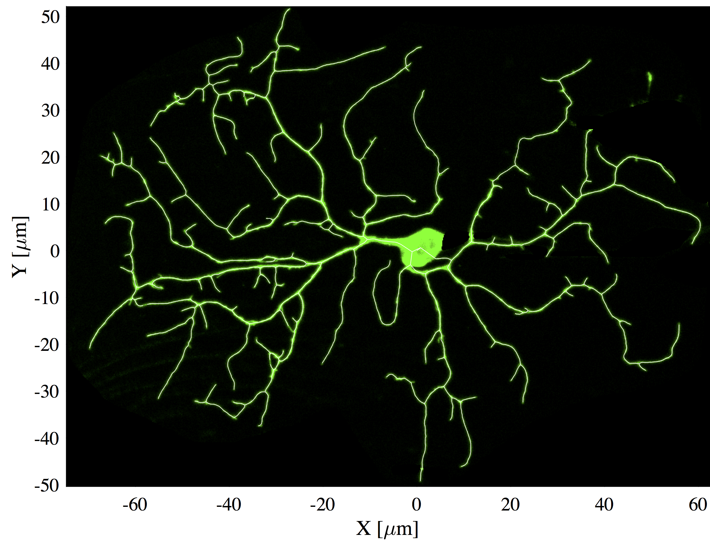

# Neuron Skeletonizer
A MATLAB implementation of the voxel scooping algorithm to skeletonize 2D images of neurons.

The [voxel scooping algorithm](https://www.sciencedirect.com/science/article/pii/S0165027009003999?via%3Dihub) was proposed in 2009 by Alfredo Rodriguez, Douglas B.Ehlenberger, Patrick R.Hof and Susan L.Wearne.

## Installation
- Install the following toolboxes:
  * Symbolic Math Toolbox
  * Image Processing Toolbox
  * Statistics and Machine Learning Toolbox

- Clone this repository in your MATLAB directory.

## Compatibility
The script was developed and run in MATLAB Version 9.6.0.1174912 (R2019a) under Mac OS X. Compatibility with previous versions of MATLAB and different OS have not been tested.

## Usage
- Load an image in an array (eg. `Image`). The image must be a double, logical or unsigned integer matrix (2D array).
- Run the following to skeletonize the neuron:
```
Tree = skel_scoop(Image);
```
- The binarization method that creates the neuron mask before scooping can be modified using the `Binarization_method` option. If the input image is a logical, the binarization is skipped.
- The index of the seed, where the first cluster originates, can be modified using the `Seed` option.
- The minimal length of the branches can be set using the `L_min` option.
- See `skel_scoop.m` for a complete list of all options available.

## Performance
Here is an example of a skeletonized neuron:



This algorithm was tested on a set of 16 bit high-contrast images. For such high-contrast images, the binarization that precedes the scooping steps is relatively easy to perform. Consequently, the performance may change considerably with a low signal-to-noise ratio. In such cases, other skeletonization algorithms may be more suitable.


## Acknowledgement
We thank Sonal Shree ([Google Scholar](https://scholar.google.com/citations?user=9wAaRw8AAAAJ&hl=en), [ORCID](https://orcid.org/0000-0002-5665-8157)) for providing us with images of Drosophila Class IV neurons.
